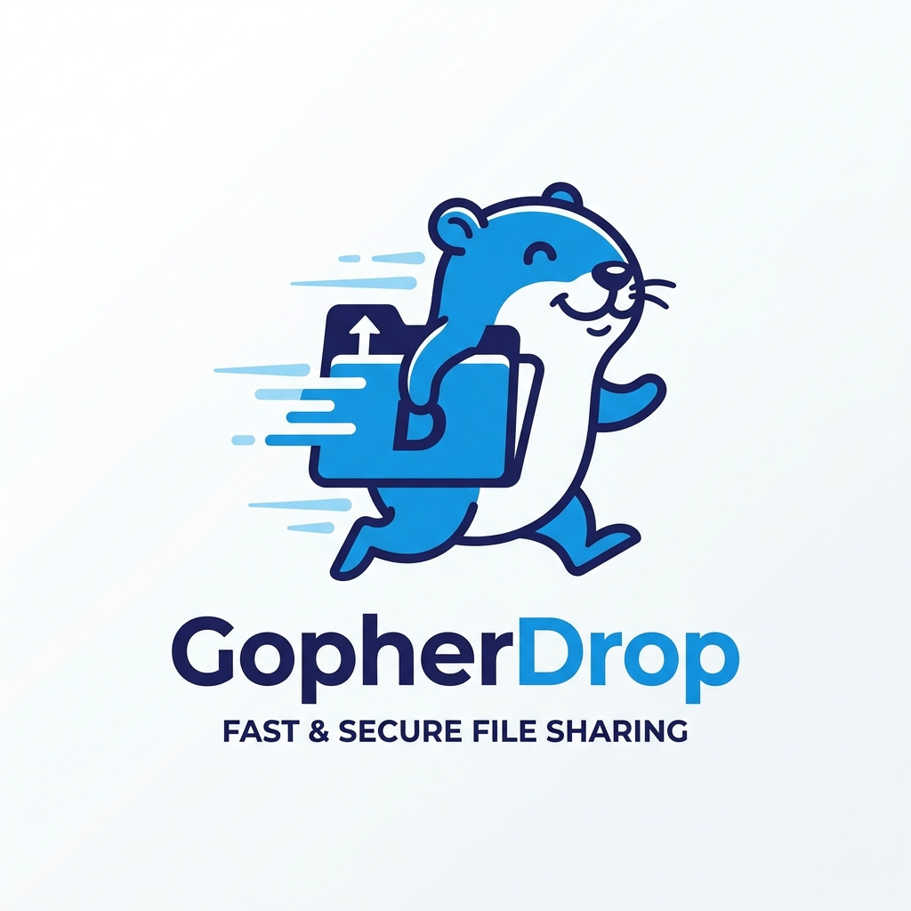

#  GopherDrop

### Servidor de gestión de archivos ultra rápido y moderno.

**GopherDrop** es una solución robusta y elegante para la gestión de archivos, construida con un backend en **Go** para una velocidad insuperable y un frontend dinámico en **React** que ofrece una experiencia de usuario premium.

---

## 🚀 Características Principales

- **Subida Instantánea**: Soporte para arrastrar y soltar (Drag & Drop) con retroalimentación en tiempo real.
- **Visualización Inteligente**: Generación automática de miniaturas para imágenes.
- **Vista Previa**: Modal integrado para visualizar imágenes sin necesidad de descarga.
- **Gestión Completa**: Listado detallado, descarga directa y eliminación permanente de archivos.
- **Estética Moderna**: Interfaz limpia diseñada con Shadcn UI y Lucide Icons.
- **Arquitectura de Microservicios**: Backend en Go (Gin) y Frontend en React, gestionados eficientemente a través de un monorepo con **Nx**.

---

## 🛠️ Stack Tecnológico

### Backend
- **Lenguaje**: [Go (Golang)](https://go.dev/)
- **Framework Web**: [Gin Gonic](https://gin-gonic.com/)
- **Base de Datos**: SQLite (vía GORM)
- **Documentación**: Swagger (vía swaggo)
- **Procesamiento de Imagen**: `disintegration/imaging` para thumbnails.

### Frontend
- **Framework**: [React](https://reactjs.org/) con Vite
- **Estilizado**: [Tailwind CSS](https://tailwindcss.com/)
- **Componentes**: [Shadcn UI](https://ui.shadcn.com/)
- **Iconografía**: [Lucide React](https://lucide.dev/)
- **Gestión de Estado/Efectos**: React Hooks (useState, useEffect, useCallback)

---

## 📦 Estructura del Proyecto

Este repositorio utiliza **Nx** para gestionar tanto el frontend como el backend en un solo lugar.

```text
GopherDrop/
├── apps/
│   ├── go-api/        # API REST escrita en Go
│   └── web/           # Aplicación Frontend en React
├── docs/              # Activos y documentación
└── packages/          # Librerías compartidas (opcional)
```

---

## 🏁 Primeros Pasos

### Requisitos Previos
- **Go** (1.21 o superior)
- **Node.js** (18 o superior)
- **npm** o **pnpm**

### Instalación

1. Clona el repositorio:
   ```bash
   git clone https://github.com/tu-usuario/GopherDrop.git
   cd GopherDrop
   ```

2. Instala las dependencias del frontend:
   ```bash
   npm install
   ```

3. Instala las dependencias del backend:
   ```bash
   cd apps/go-api
   go mod tidy
   cd ../..
   ```

---

## 🏃 Cómo ejecutar

GopherDrop utiliza Nx para simplificar la ejecución. Puedes correr ambos servicios simultáneamente:

```bash
# Ejecutar Backend y Frontend al mismo tiempo
npx nx run-many -t serve --projects=web,go-api
```

O individualmente:

```bash
# Backend solo
npx nx serve go-api

# Frontend solo
npx nx serve web
```

La API estará disponible en `http://localhost:8080` y el frontend en `http://localhost:4200`.

---

## 📖 Documentación de la API

La API cuenta con documentación automática vía Swagger. Una vez que el backend esté en ejecución, puedes acceder en:

`http://localhost:8080/swagger/index.html`

### Endpoints principales:
- `GET /files`: Lista todos los archivos.
- `POST /upload`: Sube un nuevo archivo.
- `GET /download/:id`: Descarga un archivo por su ID.
- `GET /thumbnails/:id`: Obtiene la miniatura de una imagen.
- `DELETE /files/:id`: Elimina un archivo permanentemente.

---

## 📄 Licencia

Este proyecto está bajo la Licencia MIT. Consulta el archivo [LICENSE](LICENSE) para más detalles.

---

Desarrollado con ❤️ por **Franco** utilizando Go, React y Nx.
